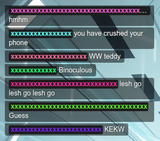
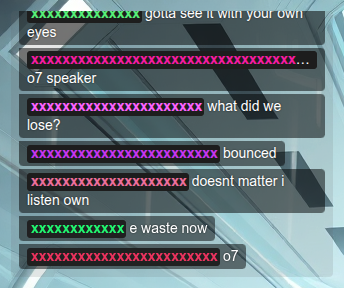
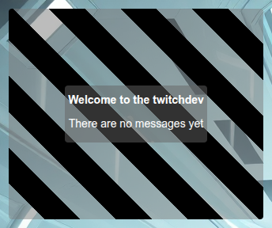
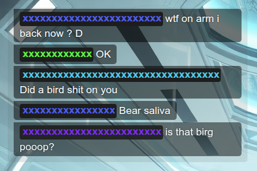
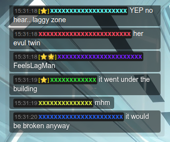

# Twichat



Display chat messages from a Twitch channel with customizable behavior and styles. It uses the [twurple](https://github.com/twurple/twurple) library to connect to the Twitch API and fetch chat data.

---

## Table of contents

- [Usage](#usage)
  - [Basic usage](#basic-usage)
  - [Run local server](#run-local-server)
  - [Advanced example](#advanced-example)
- [Parameters](#parameters)
- [Special Icons](#special-icons)
- [Animation](#animation)
- [Development](#development)
  - [Quick start](#quick-start)
    - [Installation](#installation)
    - [Running](#running)
    - [Building](#building)
    - [Formatting and Linting](#formatting-and-linting)
- [Links](#links)
- [Copyright and License](#copyright-and-license)

---

## Usage

### Basic usage

Connect to a Twitch chat channel:

```txt
https://phenomenonus.github.io/twichat?channel=mychannel
```

### Run local server

Start a local server and open:

```url
http://localhost:8000?placeholder=true
```

### Advanced example

Customize chat appearance, animation, metadata, and placeholders:

```url
https://phenomenonus.github.io/twichat?channel=mychannel&limit=150&interval=400&du_color=00ff00&uu_name=Anonymous&f_size=20&animation=movetr&cu_name=auto&meta=true&glass=true&time=true&placeholder=true
```

---

## Parameters

Use [query parameters](https://developer.mozilla.org/en-US/docs/Web/API/URLSearchParams) in the [URL](https://developer.mozilla.org/en-US/docs/Web/API/URL) to configure the chat:

| Parameter     | Description                                                                                                                                                                                                                                                 | Default          |
| ------------- | ----------------------------------------------------------------------------------------------------------------------------------------------------------------------------------------------------------------------------------------------------------- | ---------------- |
| `animation`   | Message animation type:<br>• `movetl` - move message to the left<br>• `movetr` - move message to the right<br>• `fadein` - fade in message (default)<br>• `shake` - shake message on appearance<br>• `none` - disable animation                             | `fadein`         |
| `channel`     | Your channel name. **Required**                                                                                                                                                                                                                             | `""`             |
| `cu_name`     | Type of colored usernames:<br>• `auto` - tries Twitch colors first, otherwise custom<br>• `twitch` - use Twitch color for usernames (may not always work)<br>• `custom` - generate unique colors for each user (default)<br>• `static` - use a single color | `custom`         |
| `du_color`    | Default user color when a user has no assigned color. Also used for `static` mode. Use a **hex code without `#`**.                                                                                                                                          | `34cf53` (green) |
| `f_size`      | Font size in pixels. Used to scale chat content.                                                                                                                                                                                                            | `16`             |
| `glass`       | Adds a dark glass effect to the chat layout.                                                                                                                                                                                                                | `false`          |
| `interval`    | How often to flush new messages into the chat, in milliseconds.                                                                                                                                                                                             | `300`            |
| `limit`       | Maximum number of messages displayed in the chat at runtime.                                                                                                                                                                                                | `50`             |
| `meta`        | Shows or hides special icons in messages (e.g., subscriber, first message, etc.).                                                                                                                                                                           | `true`           |
| `placeholder` | Displays a placeholder box to help position the chat. Useful for adjusting layout on screen.                                                                                                                                                                | `false`          |
| `time`        | Shows the time when the message was received.                                                                                                                                                                                                               | `false`          |
| `uu_name`     | Name used when a message has no author.                                                                                                                                                                                                                     | `__ufo`          |

---

## Special Icons

<details>
<summary>See special icons</summary>

| Icon | Meaning        |
| ---- | -------------- |
| ⭐   | Subscriber     |
| 🚀   | First message  |
| 🗡️   | Moderator      |
| ⚔️   | Lead Moderator |
| 🌟   | VIP            |

> See also: [All of Unicode](https://unicode-table.com/)

</details>

---

### Preview

<details>
<summary>Settings</summary>

| animation             | preview                                                   |
| --------------------- | --------------------------------------------------------- |
| `glass`               |                 |
| `placeholder`         |          |
| `f_size=20`           |    |
| `time=true&spec=true` |  |

</details>

<details>
<summary>See animations</summary>

| animation | preview                                                     |
| --------- | ----------------------------------------------------------- |
| `none`    |      |
| `fadein`  |  |
| `movetl`  |  |
| `movetr`  |  |
| `shake`   | ]  |

</details>

---

## Development

<details>
<summary>See development details</summary>

Follow the conventions/practices/rules described in [this repository](https://github.com/phenomenonus/development-guidelines/blob/main/README.md).

---

### Quick start

Follow the steps below to start development quickly.

---

#### Installation

Install the required packages using [npm](https://github.com/npm/cli) with the following command:

```sh
npm install
```

---

#### Running

Start the development server with the following command:

```sh
npm run dev
```

---

#### Building

Build the project with the following command:

```sh
npm run build
```

---

#### Formatting and Linting

You can format and lint the project after editing:

```sh
npm run format:check # Prettier check
npm run format       # Format files
npm run lint         # ESLint check
npm run lint:fix     # ESLint autofix
```

> The project uses [Prettier](https://prettier.io/) for code formatting and [ESLint](https://eslint.org/) for code quality checks.

</details>

---

## Links

- [development-guidelines](https://github.com/phenomenonus/development-guidelines) - summary of development conventions — a concise overview of the project's rules and practices
- [Twurple](https://github.com/twurple/twurple) - a set of libraries that aims to cover all existing [Twitch APIs](https://dev.twitch.tv/docs/api/)
- [uuid](https://github.com/uuidjs/uuid) - for the creation of [RFC9562](https://www.rfc-editor.org/rfc/rfc9562.html) (formerly [RFC4122](https://www.rfc-editor.org/rfc/rfc4122.html)) UUIDs
- [Vite](https://vite.dev/) – build tool for faster development
  - [@vitejs/plugin-react](https://github.com/vitejs/vite-plugin-react/tree/main) – vite plugin for React support
  - [vite-plugin-svgr](https://github.com/pd4d10/vite-plugin-svgr) - vite plugin to transform SVGs into React components
- [TypeScript](https://www.typescriptlang.org/) – typed superset of JavaScript
- [React](https://react.dev/) - front-end framework
- [Eslint](https://eslint.org/) - tool for fixing, finding, formatting
- [Prettier](https://prettier.io/) - formatter
- [RFC 2119](https://www.ietf.org/rfc/rfc2119.txt) - is a document that defines key words used in technical specifications to indicate requirement levels
- [Semantic Versioning](https://semver.org/)
- [Conventional Branch](https://conventional-branch.github.io/) - a specification for adding human and machine readable meaning to branch
- [Conventional Commits](https://www.conventionalcommits.org/en/v1.0.0/) - a specification for adding human and machine readable meaning to commit messages
- [Keep a Changelog](https://keepachangelog.com/en/1.1.0/) - don’t let your friends dump git logs into changelogs

---

## Copyright and License

Copyright © 2026 [Mikhail Prugov](https://github.com/phenomenonus). Code released under the [MIT License](./LICENSE).
