# Twichat

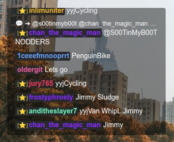

Display chat messages from a [Twitch](https://www.twitch.tv/) channel with customizable behavior and styles. It uses the [twurple](https://github.com/twurple/twurple) library to connect to the [Twitch API](https://dev.twitch.tv/docs/api/) and fetch chat data.

**Features**

- Chat customization through [parameters](#parameters)
- Message incoming
- Message deletion (includes removals due to bans)
- Chat clearing
- Raid detection (start)
- Raid cancellation detection

---

## Table of contents

- [Integration](#integration)
  - [Integrate the chat into OBS](#integrate-the-chat-into-obs)
- [Usage](#usage)
  - [Basic usage](#basic-usage)
  - [Run local server](#run-local-server)
- [Parameters](#parameters)
- [Special Icons](#special-icons)
- [Preview](#preview)
- [Development](#development)
  - [Quick start](#quick-start)
    - [Installation](#installation)
    - [Running](#running)
    - [Building](#building)
    - [Formatting and Linting](#formatting-and-linting)
- [Links](#links)
- [Copyright and License](#copyright-and-license)

---

## Integration

### Integrate the chat into [OBS](https://obsproject.com/)

1. Add a new source and choose [**Browser** (Browser Source)](https://obsproject.com/kb/browser-source).
2. Set the resolution to match your video input ([the resolution of your screen](https://en.wikipedia.org/wiki/Display_resolution)).
3. Enter the URL: `https://phenomenonus.github.io/twichat?channel=my_channel_name` (`my_channel_name` - is [Twitch](https://www.twitch.tv/) channel name)
4. Customize the chat using the [parameters](#parameters).

---

## Usage

### Basic usage

Connect to a Twitch chat channel:

```txt
https://phenomenonus.github.io/twichat?channel=mychannel&chat_bg=glass&msg_bg=glass
```

### Run local server

Start a local server and open:

```url
http://localhost:8000?placeholder=true
```

> See also: [Parameters](#parameters) and [Preview](#preview) sections.

---

## Parameters

Use [query parameters](https://developer.mozilla.org/en-US/docs/Web/API/URLSearchParams) in the [URL](https://developer.mozilla.org/en-US/docs/Web/API/URL) to configure the chat:

| Parameter     | Description                                                                                                                                                                                                                                                                                                               | Default                           |
| ------------- | ------------------------------------------------------------------------------------------------------------------------------------------------------------------------------------------------------------------------------------------------------------------------------------------------------------------------- | --------------------------------- |
| `animation`   | Message [animation](#preview) type:<br>• `movetl` - move message to the left<br>• `movetr` - move message to the right<br>• `fadein` - fade in message (default)<br>• `shake` - shake message<br>• `none` - disable animation                                                                                             | `fadein`                          |
| `channel`     | Your channel name. **Required**                                                                                                                                                                                                                                                                                           | _required_                        |
| `chat_bg`     | Chat background style:<br>• `glass` — dark glass effect<br>• `solid` — solid color background<br>• `transparent` — no background (default)                                                                                                                                                                                | `transparent`                     |
| `chat_fade`   | Controls auto-fade behavior of the chat container (opacity-based hide after inactivity).<br>• `0` — disabled (default)<br>• `number` — delay in milliseconds before chat fades out after last message update                                                                                                              | `0`                               |
| `cu_name`     | Type of colored usernames (ColorNameType). Examples:<br>• `auto` — prefer Twitch colors if available, otherwise custom (default)<br>• `twitch` — use Twitch-provided username color<br>• `custom` — generate unique colors per user<br>• `static` — use a single color for all users. See also `du_color` parameter below | `auto`                            |
| `du_color`    | Default user color when a user has no assigned color. Also used for `static` mode. Provide a [hex color](https://developer.mozilla.org/en-US/docs/Web/CSS/Reference/Values/hex-color) **without `#`** (e.g., `34cf53`).                                                                                                   | `custom` (`34cf53` commonly used) |
| `f_size`      | Font size in pixels. Use `null` to fall back to stylesheet default; otherwise provide a number (e.g., `16`).                                                                                                                                                                                                              | `16`                              |
| `interval`    | How often to flush new messages into the chat, in milliseconds.                                                                                                                                                                                                                                                           | `300`                             |
| `limit`       | Maximum number of messages displayed in the chat at runtime.                                                                                                                                                                                                                                                              | `50`                              |
| `msg_bg`      | Message background style:<br>• `glass` — glass-style message background<br>• `solid` — solid message background<br>• `transparent` — no message background (default)                                                                                                                                                      | `transparent`                     |
| `spec`        | Show [special icons](#special-icons) in messages (e.g., subscriber, first message, etc.).                                                                                                                                                                                                                                 | `true`                            |
| `placeholder` | Displays a placeholder box to help position the chat. Useful for adjusting layout on screen.                                                                                                                                                                                                                              | `false`                           |
| `theme`       | UI theme:<br>• `dark` — dark theme (default)<br>• `light` — light theme<br>• `neutral` — neutral theme                                                                                                                                                                                                                    | `dark`                            |
| `time`        | Show the time when the message was received.                                                                                                                                                                                                                                                                              | `false`                           |
| `uu_name`     | Name used when a message has no author.                                                                                                                                                                                                                                                                                   | `__ufo`                           |

---

## Special Icons

<details>
<summary>See special icons</summary>

| Icon | Meaning        |
| ---- | -------------- |
| ⭐   | Subscriber     |
| 🚀   | First message  |
| 🗡️   | Moderator      |
| ⚔️   | Lead Moderator |
| 🌟   | VIP            |

> See also: [All of Unicode](https://unicode-table.com/)

</details>

---

## Preview

<details>
<summary>Examples</summary>

| preview                                                                                                                                                   |
| --------------------------------------------------------------------------------------------------------------------------------------------------------- |
| `chat_bg=glass&f_size=20`<br>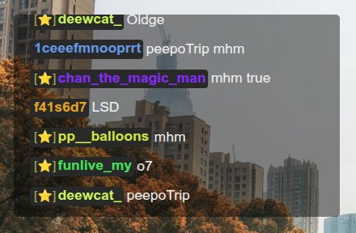                                                    |
| `chat_bg=glass`<br>                                                                                  |
| `chat_bg=glass&msg_bg=solid&theme=light`<br>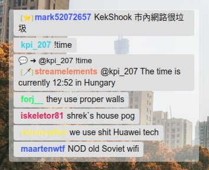       |
| `chat_bg=glass&time=true`<br>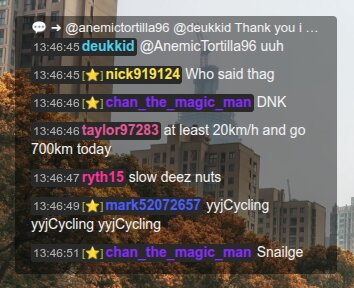                                                    |
| `chat_bg=solid`<br>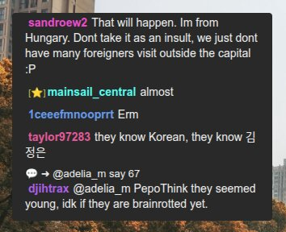                                                                                  |
| `msg_bg=glass&chat_bg=glass`<br>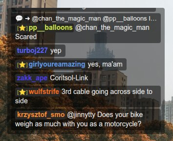                                           |
| `msg_bg=glass&chat_bg=glass&theme=light`<br>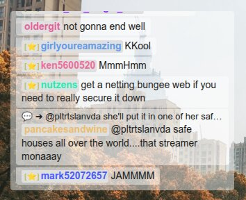       |
| `msg_bg=glass&chat_bg=glass&theme=neutral`<br>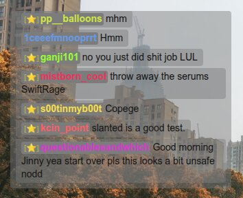 |
| `msg_bg=glass`<br>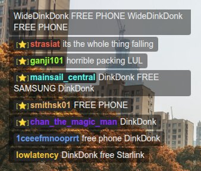                                                                                     |
| `msg_bg=solid&theme=light`<br>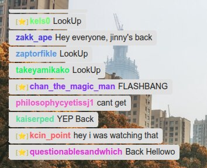                                                 |
| `placeholder=true`<br>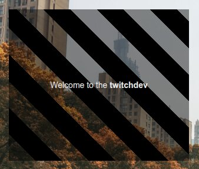                                                                         |

</details>

<details>
<summary>See animations</summary>

| preview                                                                 |
| ----------------------------------------------------------------------- |
| `none`<br>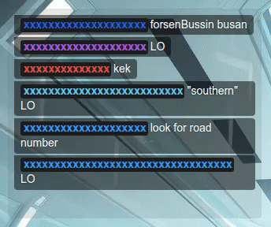       |
| `fadein`<br>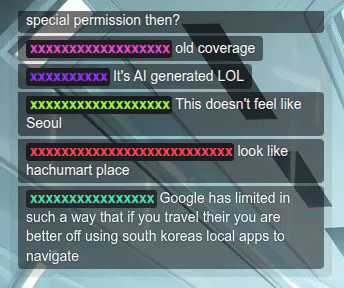 |
| `movetl`<br>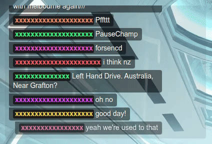 |
| `movetr`<br>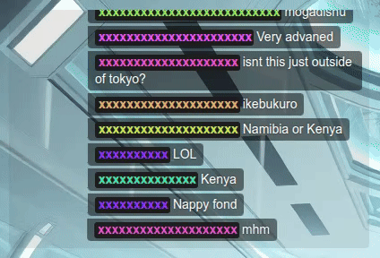 |
| `shake`<br>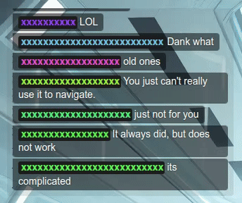    |

</details>

---

## Development

<details>
<summary>See development details</summary>

Follow the conventions/practices/rules described in [this repository](https://github.com/phenomenonus/development-guidelines/blob/main/README.md).

---

### Quick start

Follow the steps below to start development quickly.

---

#### Installation

Install the required packages using [npm](https://github.com/npm/cli) with the following command:

```sh
npm install
```

---

#### Running

Start the development server with the following command:

```sh
npm run dev
```

---

#### Building

Build the project with the following command:

```sh
npm run build
```

---

#### Formatting and Linting

Format and lint the project after editing:

```sh
npm run format:check # Prettier check
npm run format       # Format files
npm run lint         # ESLint check
npm run lint:fix     # ESLint autofix
```

> The project uses [Prettier](https://prettier.io/) for code formatting and [ESLint](https://eslint.org/) for code quality checks.

</details>

---

## Links

- [development-guidelines](https://github.com/phenomenonus/development-guidelines) - summary of development conventions — a concise overview of the project's rules and practices
- [Twurple](https://github.com/twurple/twurple) - a set of libraries that aims to cover all existing [Twitch APIs](https://dev.twitch.tv/docs/api/)
- [Vite](https://vite.dev/) – build tool for faster development
  - [@vitejs/plugin-react](https://github.com/vitejs/vite-plugin-react/tree/main) – vite plugin for React support
  - [vite-plugin-svgr](https://github.com/pd4d10/vite-plugin-svgr) - vite plugin to transform SVGs into React components
- [TypeScript](https://www.typescriptlang.org/) – typed superset of JavaScript
- [React](https://react.dev/) - front-end framework
- [Eslint](https://eslint.org/) - tool for fixing, finding, formatting
- [Prettier](https://prettier.io/) - formatter

---

## Copyright and License

Copyright © 2026 [Mikhail Prugov](https://github.com/phenomenonus). Code released under the [MIT License](./LICENSE).
